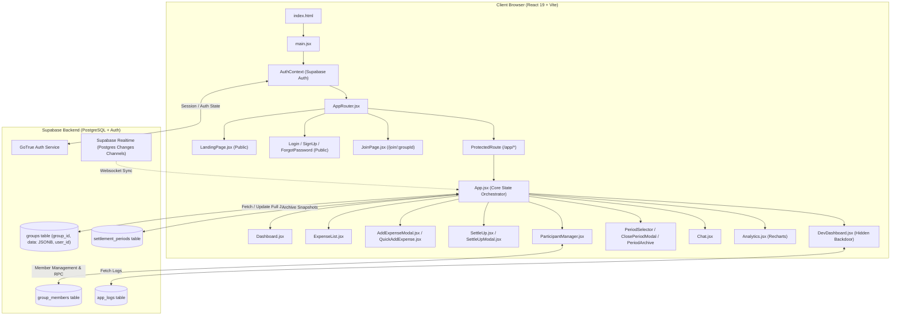

# Eplitt Audit Report

## 1. Project overview

### Stack
- **Frontend Framework & UI**: React 19.2.0 with Vite 7.2.4 (SPA architecture, ES Modules).
- **Styling**: TailwindCSS 4.1.17 with PostCSS 8.5.6 and `@tailwindcss/postcss`. Custom CSS variables and dark-mode tokens defined in `src/index.css`.
- **Routing**: React Router DOM 7.11.0 (`BrowserRouter`, `Routes`, `Route`, `Navigate`).
- **Icons & Animation**: Lucide React 0.554.0, Framer Motion 12.34.2.
- **Charts & Data Visualization**: Recharts 3.5.0.
- **Date Handling**: date-fns 4.1.0.
- **OCR Engine**: Tesseract.js 6.0.1 (client-side receipt optical character recognition).
- **PWA Capabilities**: `vite-plugin-pwa` 1.1.0 with auto-updating Service Worker.
- **Backend as a Service (BaaS)**: Supabase (`@supabase/supabase-js` 2.85.0) providing PostgreSQL, Supabase Auth, Row-Level Security (RLS), and Realtime postgres change subscriptions.
- **Legacy / Dead Stack**: Firebase SDK 12.6.0 (`firebase/app`, `firebase/firestore`), Pandas / NumPy (Python scripts for Excel migration).

### Entry Points
- **HTML Shell**: `expense-splitter-app/index.html`
- **Application Bootstrapper**: `expense-splitter-app/src/main.jsx`
- **Client Routing**: `expense-splitter-app/src/AppRouter.jsx`
- **Primary Dashboard & State Orchestrator**: `expense-splitter-app/src/App.jsx`

### Database & ORM
- **Database**: Supabase PostgreSQL.
- **ORM / Query Client**: Supabase JavaScript Client (`@supabase/supabase-js`).
- **Data Architecture**: Document-in-table model. The primary table `groups` stores entire group states (participants, expenses, activity logs, chat messages, PIN metadata) inside a single JSONB column (`data`), keyed by `group_id` with a foreign key `user_id` referencing `auth.users(id)`.
- **Supplementary Tables**:
  - `settlement_periods`: Stores archived period snapshots, date ranges, final balances, and transaction totals (referenced in `periodService.js`).
  - `group_members`: Stores group membership and role mappings (`owner`, `admin`, `member`) (referenced in `memberService.js`).
  - `app_logs`: Stores anonymous device and telemetry logs (defined in `create_logs_table.sql`).

### Authentication Method
- Supabase Auth via email and password (`signUp`, `signInWithPassword`, `signOut`, `resetPasswordForEmail`, `updateUser`).
- Global authentication state is managed through React Context in `src/contexts/AuthContext.jsx` with active session tracking via `supabase.auth.onAuthStateChange`.

### Hosting & Deployment Configuration
- Configured as a Progressive Web App (PWA) deployable as a static bundle (`dist/`) to Netlify, Vercel, or Cloudflare Pages.
- Vite build produces standard static client assets with service worker generation (`dist/sw.js`, `dist/workbox-*.js`).

### Test Framework & Existing Test Commands
- **Configured Test Scripts**: None. `package.json` contains no `"test"` script.
- **Test Code in Repository**: One test file exists at `src/services/memberService.test.js`, written with Jest/CommonJS syntax (`jest.mock`, `require`, `describe`, `it`, `expect`). However, Jest is not installed, causing ESLint failures and preventing test execution.

### Environment Variables Required to Run Locally
The project currently lacks `.env` configuration. All sensitive credentials are hard-coded in source files. To properly isolate environments, the following environment variables are required:
- `VITE_SUPABASE_URL`: The Supabase project API gateway URL (e.g., `https://<project-ref>.supabase.co`).
- `VITE_SUPABASE_ANON_KEY`: The public Supabase anonymous JWT key for client-side API requests.
- `VITE_APP_URL`: (Optional) Base application URL for password reset redirects and share links (e.g., `http://localhost:5174`).

### Architecture & Data-Flow Summary



---

## 2. Current health

| Check | Command | Result | Evidence |
|---|---|---|---|
| Dependency Installation | `npm ci` | ⚠️ PASS with Vulns | 629 packages installed in 44s. Found **25 vulnerabilities** (1 low, 4 moderate, 18 high, 2 critical). |
| Dependency Audit | `npm audit` | ❌ FAIL | Critical vulnerabilities in `protobufjs` (Arbitrary code execution / Prototype pollution) and `websocket-driver` (Resource limit bypass / memory corruption); High in `react-router`, `vite`, `postcss`, `rollup`, `ws`, `nanoid`. |
| Production Build | `npm run build` | ⚠️ PASS with Warnings | Build succeeded in 47.00s. Warning: Chunks larger than 500 kB (`dist/assets/index-X3UROxFO.js` is 1,111.22 kB / 325.04 kB gzip). |
| Linting & Syntax | `npm run lint` | ❌ FAIL | Exited with code 1. **83 problems (78 errors, 5 warnings)**. Unresolved identifier `lockGroup` in `App.jsx`, undefined Jest globals in `memberService.test.js`, React compiler memoization bailouts, impure render functions (`Date.now()`). |
| Type Checking | `npx tsc --noEmit` | ❌ FAIL | Exited with code 1 (`tsc` is not installed; project is plain JavaScript with `@types/react` in devDependencies). |
| Unit / Integration Tests | `npm test` | ❌ FAIL | Exited with code 1 (`npm error Missing script: "test"`). Jest test file exists without runner. |
| Local Dev Server Start | `npm run dev` | ✅ PASS | Vite v7.2.4 ready in 230ms on `http://localhost:5174/`. |

---

## 3. Reproducible issues

### ISS-01: Runtime ReferenceError on Period Creation in PIN-Protected Groups
- **Severity**: Critical
- **Category**: Build / Functional
- **Affected files/components**: [`src/App.jsx:L613-L616`](file:///c:/Users/mdash/Downloads/E-Splitt_Web_App/E-splitt/expense-splitter-app/src/App.jsx#L613-L616)
- **Steps to reproduce**:
  1. Open a PIN-protected group in the application.
  2. Trigger `handleCreatePeriod` by creating a new period in `PeriodSelector`.
- **Expected behavior**: Group is locked using the utility function and the new period is created.
- **Actual behavior**: Application crashes with `Uncaught ReferenceError: lockGroup is not defined`.
- **Evidence**: `App.jsx` line 615 invokes `lockGroup(currentGroupId)`, but `lockGroup` is never imported from `./utils/crypto`. ESLint reports `line 615:50: 'lockGroup' is not defined (no-undef)`.
- **Root cause**: Missing import statement for `lockGroup` in `App.jsx`.
- **Recommended fix**: Import `lockGroup` from `./utils/crypto` in `App.jsx`.
- **Suggested test**: Unit test verifying `handleCreatePeriod` executes without reference errors when `pinEnabled` is true.

---

### ISS-02: Broken Invite Links across Entire Application (`/join/undefined`)
- **Severity**: Critical
- **Category**: Functional / UX
- **Affected files/components**:
  - [`src/components/ShareGroupModal.jsx:L10`](file:///c:/Users/mdash/Downloads/E-Splitt_Web_App/E-splitt/expense-splitter-app/src/components/ShareGroupModal.jsx#L10)
  - [`src/components/InviteMemberModal.jsx:L16`](file:///c:/Users/mdash/Downloads/E-Splitt_Web_App/E-splitt/expense-splitter-app/src/components/InviteMemberModal.jsx#L16)
  - [`src/App.jsx:L265-L270, L904`](file:///c:/Users/mdash/Downloads/E-Splitt_Web_App/E-splitt/expense-splitter-app/src/App.jsx#L265-L270)
- **Steps to reproduce**:
  1. Open any group.
  2. Click Group Options → "Share Group" or click "Invite Member".
  3. Click "Copy Link" and paste the copied URL into a browser address bar.
- **Expected behavior**: Link should format as `http://localhost:5174/join/g_<groupId>`.
- **Actual behavior**: Link is generated as `http://localhost:5174/join/undefined`.
- **Evidence**:
  - In `App.jsx` line 265, `setShareGroupData({ name, code, link })` passes an object without `id`. In `ShareGroupModal.jsx` line 10, `shareUrl` reads `groupData.id` (`undefined`).
  - In `App.jsx` line 904, `<InviteMemberModal />` is rendered without passing the `groupId` prop. `InviteMemberModal.jsx` line 16 reads `groupId` (`undefined`).
- **Root cause**: Property name mismatch and missing prop binding.
- **Recommended fix**: Pass `id: group.id` in `shareGroupData` and pass `groupId={currentGroupId}` to `InviteMemberModal`.
- **Suggested test**: Component tests for `ShareGroupModal` and `InviteMemberModal` asserting that generated invite links contain the valid group ID.

---

### ISS-03: Join Group Flow Ignores Invitation on Redirect
- **Severity**: Critical
- **Category**: Functional / Routing
- **Affected files/components**:
  - [`src/components/JoinPage.jsx:L18`](file:///c:/Users/mdash/Downloads/E-Splitt_Web_App/E-splitt/expense-splitter-app/src/components/JoinPage.jsx#L18)
  - [`src/components/auth/SignUp.jsx:L56`](file:///c:/Users/mdash/Downloads/E-Splitt_Web_App/E-splitt/expense-splitter-app/src/components/auth/SignUp.jsx#L56)
  - [`src/components/auth/Login.jsx:L34`](file:///c:/Users/mdash/Downloads/E-Splitt_Web_App/E-splitt/expense-splitter-app/src/components/auth/Login.jsx#L34)
  - [`src/App.jsx:L80, L125-L146`](file:///c:/Users/mdash/Downloads/E-Splitt_Web_App/E-splitt/expense-splitter-app/src/App.jsx#L80)
- **Steps to reproduce**:
  1. Open a valid invite URL `/join/g_12345`.
  2. Sign up or log in.
  3. User is redirected to `/app` with router state `{ joinGroupId: 'g_12345' }`.
- **Expected behavior**: `App.jsx` reads `joinGroupId`, joins the user to the group, and sets `currentGroupId` to `'g_12345'`.
- **Actual behavior**: `App.jsx` completely ignores `location.state.joinGroupId` and selects the user's first existing group or auto-creates a "Welcome Group".
- **Evidence**: `App.jsx` line 80 declares `const location = useLocation();`, but `location.state` is never read anywhere in `App.jsx`. ESLint reports `'location' is assigned a value but never used (no-unused-vars)`.
- **Root cause**: Incomplete implementation of the join-redirection handling logic in `App.jsx`.
- **Recommended fix**: In `App.jsx`, inspect `location.state?.joinGroupId` upon initialization, invoke `addGroupMember`, and set `currentGroupId(joinGroupId)`.
- **Suggested test**: Integration test verifying that navigation to `/app` with `joinGroupId` state triggers membership enrollment and selects the group.

---

### ISS-04: Monolithic JSONB Document Overwrite Concurrency / Race Condition
- **Severity**: Critical
- **Category**: Data integrity / Concurrency
- **Affected files/components**:
  - [`src/services/supabaseService.js:L53-L77, L320-L337`](file:///c:/Users/mdash/Downloads/E-Splitt_Web_App/E-splitt/expense-splitter-app/src/services/supabaseService.js#L53-L77)
  - [`src/App.jsx:L320-L337`](file:///c:/Users/mdash/Downloads/E-Splitt_Web_App/E-splitt/expense-splitter-app/src/App.jsx#L320-L337)
- **Steps to reproduce**:
  1. Two users in the same group open the application simultaneously.
  2. User A adds an expense for $50.
  3. User B simultaneously adds an expense for $25.
- **Expected behavior**: Both expenses are committed and persisted.
- **Actual behavior**: Last-write-wins. The client that saves last overwrites the entire `data` JSONB object, obliterating the other user's expense.
- **Evidence**: `updateGroupInSupabase` executes `supabase.from('groups').select('data').eq('group_id', groupId).single()` followed by updating the entire `data` column without optimistic locking, version numbers, or row-level atomic operations.
- **Root cause**: Anti-pattern of storing relational data (expenses, chat, participants, logs) inside a single un-normalized JSONB document.
- **Recommended fix**: Normalize the schema into discrete tables (`expenses`, `expense_splits`, `chat_messages`, `group_participants`) or implement atomic PostgreSQL append functions / optimistic concurrency control (`version_id`).
- **Suggested test**: Concurrent write test asserting that simultaneous expense submissions from different sessions are both retained.

---

### ISS-05: Hardcoded Supabase and Firebase API Credentials in Source Code
- **Severity**: High
- **Category**: Security / Maintainability
- **Affected files/components**:
  - [`src/supabase.js:L4-L5`](file:///c:/Users/mdash/Downloads/E-Splitt_Web_App/E-splitt/expense-splitter-app/src/supabase.js#L4-L5)
  - [`src/firebase.js:L6-L13`](file:///c:/Users/mdash/Downloads/E-Splitt_Web_App/E-splitt/expense-splitter-app/src/firebase.js#L6-L13)
  - [`.gitignore:L1-L25`](file:///c:/Users/mdash/Downloads/E-Splitt_Web_App/E-splitt/expense-splitter-app/.gitignore#L1-L25)
- **Steps to reproduce**:
  1. Inspect `src/supabase.js` and `src/firebase.js`.
- **Expected behavior**: Credentials are read from `import.meta.env.VITE_*` and `.env` files are ignored in `.gitignore`.
- **Actual behavior**: Production Supabase URL, Anon JWT Key, and complete Firebase API credentials (API key, project ID, App ID) are hardcoded in git. `.gitignore` does not include `.env`.
- **Evidence**:
  ```javascript
  const supabaseUrl = 'https://zgykugrvbfteuzxyxoot.supabase.co'
  const supabaseAnonKey = 'eyJhbGciOiJIUzI1NiIsInR5cCI6IkpXVCJ9...'
  ```
- **Root cause**: Lack of environment variable configuration.
- **Recommended fix**: Extract credentials to `.env`, create `.env.example`, add `.env` / `.env.*` to `.gitignore`, and rotate exposed keys.
- **Suggested test**: Pre-commit / build check ensuring no raw API keys or hardcoded project URLs exist in source files.

---

### ISS-06: Hardcoded Developer Dashboard Backdoor
- **Severity**: High
- **Category**: Security
- **Affected files/components**:
  - [`src/components/DevDashboard.jsx:L12, L27-L36`](file:///c:/Users/mdash/Downloads/E-Splitt_Web_App/E-splitt/expense-splitter-app/src/components/DevDashboard.jsx#L12)
  - [`src/App.jsx:L304-L318, L905`](file:///c:/Users/mdash/Downloads/E-Splitt_Web_App/E-splitt/expense-splitter-app/src/App.jsx#L304-L318)
- **Steps to reproduce**:
  1. Click the E-Split header logo 5 times in rapid succession.
  2. In the modal, enter PIN: `admin`.
- **Expected behavior**: Administrative dashboards should require role-based authentication (`auth.users` role claim or server-side authorization).
- **Actual behavior**: Anyone can access device access telemetry, user agents, screen resolutions, and group IDs logged across the platform.
- **Evidence**: `DevDashboard.jsx` line 12: `const DEV_PIN = 'admin';`.
- **Root cause**: Hardcoded client-side bypass for debugging telemetry.
- **Recommended fix**: Remove the client backdoor, restrict access to `app_logs` using Supabase RLS admin policies, and verify admin role from session claims.
- **Suggested test**: Security test verifying that non-admin accounts cannot query `app_logs` via the Supabase client.

---

### ISS-07: Client-Side PIN Security Bypass and Plaintext PIN Storage
- **Severity**: High
- **Category**: Security / Data integrity
- **Affected files/components**:
  - [`src/App.jsx:L218-L228, L280-L302`](file:///c:/Users/mdash/Downloads/E-Splitt_Web_App/E-splitt/expense-splitter-app/src/App.jsx#L280-L302)
  - [`src/utils/crypto.js:L4-L39`](file:///c:/Users/mdash/Downloads/E-Splitt_Web_App/E-splitt/expense-splitter-app/src/utils/crypto.js#L4-L39)
- **Steps to reproduce**:
  1. Set a 4-digit PIN on a group.
  2. Inspect the network tab or browser React state / Supabase response.
- **Expected behavior**: Group data is encrypted or protected on the server; PIN is securely hashed with salt (e.g. Argon2 / bcrypt).
- **Actual behavior**:
  - `App.jsx` line 293 stores plain-text `pin` in the database (`updateGroupInSupabase(..., { pin, pinEnabled: true })`).
  - Full group data (all expenses, participants, chat) is downloaded to the client *before* the PIN is entered. PIN verification is purely cosmetic in React state.
- **Evidence**: `App.jsx` line 283: `if (group && group.pin === pin)` compares unhashed plaintext.
- **Root cause**: Incomplete integration of `crypto.js` and reliance on client-side state gating.
- **Recommended fix**: If groups require password protection, protect access at the RLS / PostgreSQL function level or encrypt group payloads client-side.
- **Suggested test**: Verification test asserting that unauthenticated or locked group queries cannot retrieve expense payloads.

---

### ISS-08: Participant ID vs. Auth UUID Mismatch in QuickAddExpense
- **Severity**: High
- **Category**: Data integrity / Functional
- **Affected files/components**:
  - [`src/components/QuickAddExpense.jsx:L7, L12-L18, L55-L59`](file:///c:/Users/mdash/Downloads/E-Splitt_Web_App/E-splitt/expense-splitter-app/src/components/QuickAddExpense.jsx#L7)
  - [`src/App.jsx:L823-L827`](file:///c:/Users/mdash/Downloads/E-Splitt_Web_App/E-splitt/expense-splitter-app/src/App.jsx#L823-L827)
  - [`src/utils/splitLogic.js:L65-L71`](file:///c:/Users/mdash/Downloads/E-Splitt_Web_App/E-splitt/expense-splitter-app/src/utils/splitLogic.js#L65-L71)
- **Steps to reproduce**:
  1. In a group with participants (IDs formatted as `user_1740...`), add an expense using QuickAddExpense without touching the "Paid By" dropdown.
- **Expected behavior**: Expense is recorded with the participant ID of the logged-in user.
- **Actual behavior**: `paidBy` is recorded as the Supabase Auth UUID (e.g. `f47ac10b-...`). Because this UUID does not match any participant in `participants`, the dashboard and settlements create a ghost user named `"Unknown (f47ac10b-...)"`.
- **Evidence**: In `QuickAddExpense.jsx` line 7: `const [paidBy, setPaidBy] = useState(currentUserId || '');`. `currentUserId` is `user.id` (Auth UUID), whereas `participants` contain client IDs generated as `user_${Date.now()}`.
- **Root cause**: Inconsistent identity model between Supabase Auth users and local group participant objects.
- **Recommended fix**: Link participant profiles directly to `user.id` or match the current user's email to participant emails in `ParticipantManager`.
- **Suggested test**: Unit test ensuring QuickAddExpense attributes payments to a valid participant ID in the group.

---

### ISS-09: Missing Database Schemas for Settlement Periods & Group Members
- **Severity**: High
- **Category**: Data integrity / Schema
- **Affected files/components**:
  - [`src/services/periodService.js:L22, L52, L83`](file:///c:/Users/mdash/Downloads/E-Splitt_Web_App/E-splitt/expense-splitter-app/src/services/periodService.js#L22)
  - [`src/services/memberService.js:L20, L55, L83, L123`](file:///c:/Users/mdash/Downloads/E-Splitt_Web_App/E-splitt/expense-splitter-app/src/services/memberService.js#L20)
  - [`supabase_auth_setup.sql:L1-L67`](file:///c:/Users/mdash/Downloads/E-Splitt_Web_App/E-splitt/expense-splitter-app/supabase_auth_setup.sql#L1-L67)
- **Steps to reproduce**:
  1. Set up a fresh Supabase database using all provided SQL migration files (`supabase_auth_setup.sql`, `create_default_group.sql`, `create_logs_table.sql`).
  2. Attempt to use Period Archiving or Member Invites / Role Management.
- **Expected behavior**: Tables `settlement_periods` and `group_members`, and RPCs `search_users_by_email` and `add_group_member` exist.
- **Actual behavior**: Database queries fail with table/function not found errors (PostgreSQL code `42P01` / `42883`).
- **Evidence**: Grepping the repository confirms `settlement_periods`, `group_members`, `search_users_by_email`, and `add_group_member` are referenced in JavaScript but have zero DDL definitions in any `.sql` file.
- **Root cause**: Database migration scripts were created in the Supabase dashboard but never checked into version control.
- **Recommended fix**: Author complete SQL migration scripts creating `settlement_periods`, `group_members`, and secure PostgreSQL RPC functions with proper RLS policies.
- **Suggested test**: Database migration CI step executing all `.sql` files on a clean PostgreSQL instance.

---

### ISS-10: Settlement Reimbursements Distort Group Spending Analytics
- **Severity**: High
- **Category**: Functional / Data integrity
- **Affected files/components**:
  - [`src/utils/splitLogic.js:L16-L24, L51-L57`](file:///c:/Users/mdash/Downloads/E-Splitt_Web_App/E-splitt/expense-splitter-app/src/utils/splitLogic.js#L16-L24)
  - [`src/components/Dashboard.jsx:L5-L7, L13-L16, L50-L51`](file:///c:/Users/mdash/Downloads/E-Splitt_Web_App/E-splitt/expense-splitter-app/src/components/Dashboard.jsx#L5-L7)
- **Steps to reproduce**:
  1. User A pays $100 for groceries split equally with User B (A paid $100, B share $50).
  2. User B settles $50 with User A.
  3. Check the Dashboard card for Total Paid and Total Group Spending.
- **Expected behavior**: Group total spending is $100. User A spent $100; User B spent $0 on direct expenses.
- **Actual behavior**: Total Group Spending displays $150. User A total paid displays $100; User B total paid displays $50; both show a 50% share of spending.
- **Evidence**: In `splitLogic.js` line 22: `if (expense.isSettlement) { totalPaid[expense.paidBy] += expense.amount; ... }`. Settlements increment `totalPaid`, which `Dashboard.jsx` sums into `totalGroupSpending`.
- **Root cause**: Conflating settlement reimbursement cash flow with purchase expense spending in the balance calculation return object.
- **Recommended fix**: Separate `totalExpensesPaid` from `totalSettlementsPaid` in `calculateBalances`, and only use direct expenses for spending analytics and progress bars.
- **Suggested test**: Financial calculation test verifying that settlements do not increase total expense volume or skew spending percentage metrics.

---

### ISS-11: Floating-Point Penny Rounding Discrepancy on Equal Splits
- **Severity**: Medium
- **Category**: Data integrity / Calculations
- **Affected files/components**:
  - [`src/components/AddExpenseModal.jsx:L127-L144`](file:///c:/Users/mdash/Downloads/E-Splitt_Web_App/E-splitt/expense-splitter-app/src/components/AddExpenseModal.jsx#L127-L144)
  - [`src/components/QuickAddExpense.jsx:L42-L48`](file:///c:/Users/mdash/Downloads/E-Splitt_Web_App/E-splitt/expense-splitter-app/src/components/QuickAddExpense.jsx#L42-L48)
- **Steps to reproduce**:
  1. Add an expense of $100 split equally among 3 participants.
- **Expected behavior**: Shares are allocated as $33.34, $33.33, $33.33 (summing exactly to $100.00).
- **Actual behavior**: Each participant receives `33.333333333333336`. Display components format with `.toFixed(2)` showing $33.33 + $33.33 + $33.33 = $99.99 (a 1-cent discrepancy).
- **Evidence**: `AddExpenseModal.jsx` line 134: `const share = amountFloat / selected.length; selected.forEach(userId => shares[userId] = share);`.
- **Root cause**: No integer/cent-based allocation or remainder distribution algorithm.
- **Recommended fix**: Implement standard integer arithmetic in cents, distributing remainder pennies to the payer or first participant(s) so `sum(shares) === totalAmount` exactly.
- **Suggested test**: Property-based test testing all splits from 2 to 20 participants across arbitrary dollar amounts to ensure 100% exact reconciliation.

---

### ISS-12: Missing Test Runner & Orphaned Test Causing ESLint Failure
- **Severity**: Medium
- **Category**: Testing / Maintainability
- **Affected files/components**:
  - [`src/services/memberService.test.js:L1-L58`](file:///c:/Users/mdash/Downloads/E-Splitt_Web_App/E-splitt/expense-splitter-app/src/services/memberService.test.js#L1-L58)
  - [`package.json:L6-L11`](file:///c:/Users/mdash/Downloads/E-Splitt_Web_App/E-splitt/expense-splitter-app/package.json#L6-L11)
  - [`eslint.config.js:L1-L30`](file:///c:/Users/mdash/Downloads/E-Splitt_Web_App/E-splitt/expense-splitter-app/eslint.config.js#L1-L30)
- **Steps to reproduce**:
  1. Run `npm run lint`.
- **Expected behavior**: Lint passes cleanly on all test and source files.
- **Actual behavior**: Lint fails with 16 errors in `memberService.test.js` because `jest`, `require`, `describe`, `it`, `expect` are undeclared.
- **Evidence**: ESLint output lists 16 `no-undef` errors in `src/services/memberService.test.js`.
- **Root cause**: Test file was written for Jest/CommonJS in an ESM Vite project without installing or configuring Vitest/Jest.
- **Recommended fix**: Install `vitest`, configure ESM test runner, add `"test": "vitest run"` to `package.json`, and update ESLint globals.
- **Suggested test**: Execute `npm test` and `npm run lint` in CI pipeline.

---

### ISS-13: Missing `/reset-password` Route & Broken `onBack` in ForgotPassword
- **Severity**: Medium
- **Category**: Functional / UX
- **Affected files/components**:
  - [`src/AppRouter.jsx:L32-L55`](file:///c:/Users/mdash/Downloads/E-Splitt_Web_App/E-splitt/expense-splitter-app/src/AppRouter.jsx#L32-L55)
  - [`src/contexts/AuthContext.jsx:L86`](file:///c:/Users/mdash/Downloads/E-Splitt_Web_App/E-splitt/expense-splitter-app/src/contexts/AuthContext.jsx#L86)
  - [`src/components/auth/ForgotPassword.jsx:L5, L46, L63`](file:///c:/Users/mdash/Downloads/E-Splitt_Web_App/E-splitt/expense-splitter-app/src/components/auth/ForgotPassword.jsx#L5)
- **Steps to reproduce**:
  1. Request a password reset email.
  2. Click the link in the received email (directs to `/reset-password`).
  3. Navigate to `/forgot-password` and click "Back to Login".
- **Expected behavior**:
  - `/reset-password` renders a form to enter a new password.
  - "Back to Login" navigates the user back to `/login`.
- **Actual behavior**:
  - `/reset-password` renders blank/404 because no route exists in `AppRouter.jsx`.
  - "Back to Login" calls `onBack` which is `undefined`, doing nothing.
- **Evidence**: `AuthContext.jsx` line 86 sets `redirectTo: ${window.location.origin}/reset-password`, but `AppRouter.jsx` has no such route. `ForgotPassword.jsx` expects `onBack` prop but `AppRouter.jsx` renders `<ForgotPassword />` without props.
- **Root cause**: Missing password update component/route and unhandled navigation in `ForgotPassword.jsx`.
- **Recommended fix**: Add `useNavigate()` to `ForgotPassword.jsx` for "Back to Login" and create a `ResetPassword.jsx` component mapped to `/reset-password`.
- **Suggested test**: End-to-end test simulating password reset request and password update flow.

---

### ISS-14: Dead Dependencies and Orphaned Legacy Code in Repository
- **Severity**: Low
- **Category**: Maintainability / Performance
- **Affected files/components**:
  - `package.json` (`firebase` 12.6.0)
  - `src/services/firestore.js`
  - `src/firebase.js`
  - `src/App.jsx.backup`
  - `src/App_imports.jsx`
  - `src/test.jsx`
  - `src/data/initialData.json`
  - `analyze_excel.py`
  - `convert_excel_to_json.py`
  - `Oct 19 - Nov 21.xlsx`
- **Steps to reproduce**:
  1. Inspect bundle size and project files.
- **Expected behavior**: Clean codebase containing only active, imported files.
- **Actual behavior**: 10+ abandoned legacy files and the full Firebase SDK remain in the repository.
- **Evidence**: `firebase` package installed but never imported by active application; multiple `.backup` and migration scripts in root.
- **Root cause**: Incomplete cleanup following migration from Firebase to Supabase.
- **Recommended fix**: Uninstall `firebase`, delete orphaned backup and scratch files, and clean obsolete imports.
- **Suggested test**: Clean tree verification script checking for unreferenced files.

---

### ISS-15: Monolithic Client Bundle Exceeding 1.1 MB
- **Severity**: Low
- **Category**: Performance
- **Affected files/components**:
  - [`vite.config.js:L1-L37`](file:///c:/Users/mdash/Downloads/E-Splitt_Web_App/E-splitt/expense-splitter-app/vite.config.js#L1-L37)
  - `dist/assets/index-X3UROxFO.js` (1,111.22 kB)
- **Steps to reproduce**:
  1. Run `npm run build`.
- **Expected behavior**: Bundles split into modular chunks (vendor, OCR, charts) with entry under 300 kB.
- **Actual behavior**: Vite emits a single 1.11 MB bundle containing Tesseract.js, Recharts, Framer Motion, and Supabase.
- **Evidence**: Vite build warning: `(!) Some chunks are larger than 500 kB after minification`.
- **Root cause**: Synchronous imports of heavy libraries (`tesseract.js`, `recharts`) in components without dynamic `React.lazy()` code splitting.
- **Recommended fix**: Lazy-load `AddExpenseModal` (OCR), `Analytics` (Recharts), and configure `manualChunks` in `vite.config.js`.
- **Suggested test**: Lighthouse / bundle size budget check in build pipeline.

---

## 4. Expense-splitting correctness

### Equal Split
- **Current Logic**: `shares[userId] = amount / selectedParticipants.length`.
- **Findings**:
  - Values are stored as unrounded IEEE 754 floating-point numbers in the database.
  - In uneven divisions (e.g. $10.00 / 3 = 3.3333333333333335), summing formatted shares produces $9.99, losing $0.01.
  - When editing an expense, the app attempts to detect equal split with `Math.abs(s - shares[0]) < 0.01`. If precision varies, it can mistakenly flip split types.

### Unequal / Custom Split
- **Current Logic**: User inputs exact dollar amounts per participant in `AddExpenseModal`.
- **Findings**:
  - Validation checks `Math.abs(totalShares - amountFloat) > 0.01`. If within 1 cent, submission is allowed, which can still introduce minor balance drift.
  - No support for split by percentages (%), shares/weights (e.g. 2:1:1), or itemized adjustments.

### Decimal Rounding
- **Current Logic**: `.toFixed(2)` is used extensively across UI components and export scripts.
- **Findings**:
  - Floating-point addition on JavaScript numbers leads to floating point drift (e.g. `0.1 + 0.2 = 0.30000000000000004`).
  - While `splitLogic.js` uses `Number(amount.toFixed(2))` during settlements, balances stored in state and JSON are raw floats.
  - Total expenses displayed on Dashboard use `parseFloat(e.amount)` which is resilient, but unrounded shares can accumulate inaccuracies over large transaction volumes.

### Settlements
- **Current Logic**: A settlement is recorded as a pseudo-expense with `isSettlement: true`, `paidBy: fromId`, `paidTo: toId`, `shares: { [toId]: amount }`.
- **Findings**:
  - Balance netting math is mathematically correct: `balances = totalPaid - totalShare`. Payer balance increases (less negative), receiver balance decreases (less positive).
  - Debt settlement algorithm in `calculateSettlements` uses a greedy two-pointer creditor/debtor matching algorithm ($O(N \log N)$), which produces minimal transaction paths.
  - **Flaw**: `totalPaid` includes settlement reimbursements, corrupting group expense totals and individual spending percentages on Dashboard.

### Editing and Deleting Expenses
- **Current Logic**: Expenses are identified by `id: Date.now()`.
- **Findings**:
  - `Date.now()` is not guaranteed to be unique if expenses are created in rapid succession or generated in batches/imports.
  - Deletion triggers an optimistic update with a custom double-click in `ExpenseList.jsx`, but then immediately calls `confirm()` dialog in `App.jsx`, resulting in a jarring double-confirmation UX.
  - Undo functionality in `ActivityLog.jsx` restores `previousState` but can overwrite intermediate modifications if multiple users edit concurrently.

### Group & Member Permissions
- **Current Logic**: Supabase RLS checks `auth.uid() = user_id`.
- **Findings**:
  - `groups` table only stores the group creator's `user_id`. When a creator shares a group with another user, the second user cannot query the `groups` table under default RLS because `auth.uid() != user_id`.
  - The application attempted to build a secondary `group_members` table, but it is not linked to RLS in `supabase_auth_setup.sql`. This means multi-user group sharing will fail under strict RLS or completely bypass authorization if RLS is disabled.

### Data Consistency and Race Conditions
- **Findings**:
  - Because all group data lives in a single JSONB blob `groups.data`, any concurrent update (e.g., adding an expense while another user sends a chat message) will trigger a full document replacement, causing data loss.
  - Optimistic locking (`isMutating` state lock) only operates locally within a single browser tab and offers zero cross-client synchronization safety.

---

## 5. Security review

### Confirmed Security Issues
1. **Hard-Coded API Credentials in Git Repository**:
   - Supabase project URL and anon public JWT key in `src/supabase.js`.
   - Firebase API Key, Project ID, App ID in `src/firebase.js`.
   - `.env` files are not listed in `.gitignore`.
2. **Backdoor in Developer Dashboard**:
   - Logo 5-click easter egg bypasses authentication with hardcoded PIN `'admin'` (`DevDashboard.jsx`), querying all access logs and device identifiers.
3. **Plaintext & Unauthenticated Group PIN Storage**:
   - Group PINs are stored in plaintext as `group.pin` in Supabase and evaluated client-side.
   - Protected group data is sent over the network before PIN validation occurs.
4. **Client-Side Authorizations & Insecure Direct Object Reference (IDOR)**:
   - Client fetches group data directly by `group_id`. Without verified group-membership RLS policies, any logged-in user who guesses or discovers a `group_id` can read/write that group's entire financial history.
5. **NoSQL / JSON Injection & Large Payload Vulnerability**:
   - `groups.data` accepts arbitrary unvalidated JSONB payloads with no schema validation or size limits on the database layer.

### Items Requiring Manual Verification / Cloud Console Inspection
1. **Supabase Production RLS Status**:
   - Verify whether Row Level Security is currently enabled and enforced on `groups`, `settlement_periods`, `group_members`, and `app_logs` in the live Supabase project (`zgykugrvbfteuzxyxoot`).
2. **PostgreSQL RPC Execution Permissions**:
   - Verify whether `search_users_by_email` and `add_group_member` are declared with `SECURITY DEFINER` and whether `search_users_by_email` leaks sensitive user metadata across tenant boundaries.
3. **Firebase Project Decommissioning**:
   - Verify whether the Firestore database `e-split-a98b8` is still in "Test Mode" (`allow read, write: if true;`) allowing public unauthorized data access.

---

## 6. Test coverage gaps

Ranked by risk and critical business impact:

| Priority | Area | Flow / Component | Risk Description |
|---|---|---|---|
| 🔴 P0 | Auth & Authorization | RLS & Group Isolation | Risk of cross-tenant data leakage where User A can read/write User B's private group expenses. |
| 🔴 P0 | Calculations | Equal & Unequal Split Rounding | Risk of financial balance mismatches (penny loss) where allocated shares do not sum to total expense. |
| 🔴 P0 | Calculations | Settlement & Net Balance Integrity | Risk of debt distortion where settlements inflate expense volume or fail to zero out debts. |
| 🟡 P1 | Routing & Onboarding | Invite Link & Join Redirection | Risk of newly invited users failing to join targeted groups upon signup/login. |
| 🟡 P1 | Data Concurrency | Concurrent Expense Updates | Risk of silent data loss when multiple members record transactions simultaneously. |
| 🟡 P1 | Periods | Period Archiving & Balance Reset | Risk of unsettled balances being erased without carryover or corrupted archive snapshots. |
| 🟢 P2 | Client Security | PIN Protection & Cryptographic Hash | Verification that protected groups cannot be queried or unlocked without valid credentials. |
| 🟢 P2 | Input Validation | Expense Form Edge Cases | Validation of zero, negative, extreme values, empty strings, and special character sanitization. |

---

## 7. Recommended repair plan

### Phase A: Make the project run & clean baseline
- **Scope**:
  - Install Vitest and testing utilities (`vitest`, `@testing-library/react`, `jsdom`).
  - Fix all 83 ESLint errors (undefined `lockGroup`, undeclared test globals, React compiler warnings).
  - Migrate hardcoded secrets to `.env` and configure `.env.example` and `.gitignore`.
  - Remove dead files (`src/App.jsx.backup`, `src/App_imports.jsx`, `src/test.jsx`, `src/services/firestore.js`, `src/firebase.js`).
- **Risk**: Very Low.
- **Dependencies**: None.
- **Acceptance Criteria**: `npm run build`, `npm run lint`, and `npm test` all pass with zero errors and zero warnings.

### Phase B: Fix critical security & data integrity issues
- **Scope**:
  - Author complete SQL migration scripts for `settlement_periods`, `group_members`, and RPC functions.
  - Implement proper multi-user RLS policies linking group membership to user IDs.
  - Resolve Auth UUID vs. Participant ID mismatch in `QuickAddExpense` and `ParticipantManager`.
  - Remove developer backdoor (`DevDashboard.jsx`) and replace plaintext PINs with cryptographic server-side validation or remove client-side PIN gating.
- **Risk**: Medium (requires database schema alignment).
- **Dependencies**: Phase A.
- **Acceptance Criteria**: Multi-user groups function securely under RLS; no unauthorized data access possible; no ghost `"Unknown"` users created in QuickAdd.

### Phase C: Fix core expense workflows & calculations
- **Scope**:
  - Implement cent-based penny remainder distribution for equal splits.
  - Fix `calculateBalances` so settlement transfers do not inflate total spending or individual spending percentages on Dashboard.
  - Fix `/join/:groupId` invite link generation in `ShareGroupModal` and `InviteMemberModal`.
  - Wire up `location.state.joinGroupId` in `App.jsx` to complete the invite flow.
  - Implement `/reset-password` route and fix navigation in `ForgotPassword.jsx`.
- **Risk**: Low.
- **Dependencies**: Phase B.
- **Acceptance Criteria**: Exact penny reconciliation on all splits; clean settlement stats; invite links work seamlessly end-to-end.

### Phase D: Improve tests, accessibility, performance, and documentation
- **Scope**:
  - Code-split heavy libraries (`tesseract.js`, `recharts`) using `React.lazy()` and configure Vite `manualChunks`.
  - Add comprehensive Vitest test suite for `splitLogic.js`, `periodService.js`, and `memberService.js`.
  - Enhance accessibility (ARIA labels, keyboard navigation, focus management on modals).
  - Plan relational schema migration (moving from single JSONB blob to normalized `expenses` table).
- **Risk**: Low.
- **Dependencies**: Phase C.
- **Acceptance Criteria**: Bundle size under 300 kB; 90%+ test coverage on calculation engine; WCAG compliant modals.

---

## 8. Questions for the owner

1. **Database Schema Strategy**: Should we normalize the database schema now (creating dedicated `expenses`, `expense_splits`, and `chat_messages` tables), or maintain the single-row JSONB document model with optimistic locking?
2. **Multi-User Collaboration Model**: How should unauthenticated / non-registered users be handled? Should participants always be linked to real registered Supabase user accounts, or should groups allow "virtual / guest" participants managed by the group owner?
3. **Period Archiving Debt Policy**: When closing a settlement period with outstanding debts, should the remaining balances automatically carry over into the new period as opening balances, or remain strictly archived?
4. **Group PIN Feature**: Is the 4-digit PIN feature intended as a lightweight privacy screen or actual encryption? If privacy only, should we migrate it to proper password-protected group invites?
5. **Firebase Legacy Status**: Can the Firebase project (`e-split-a98b8`) and its dependencies be permanently decommissioned and deleted?

---

## Top 10 next actions

1. **Fix `lockGroup` Reference Error in `App.jsx`**: Import `lockGroup` from `./utils/crypto` to eliminate fatal crash during period creation.
2. **Fix Broken Invite Links**: Pass valid `id` and `groupId` props in `ShareGroupModal` and `InviteMemberModal` to resolve `/join/undefined` URLs.
3. **Handle Join Redirection in `App.jsx`**: Read `location.state?.joinGroupId` upon authentication to automatically enroll and route invited users.
4. **Migrate Secrets to Environment Variables**: Move Supabase keys from `src/supabase.js` to `.env`, create `.env.example`, and update `.gitignore`.
5. **Fix Settlement Double-Counting in `splitLogic.js`**: Separate expense spending from reimbursement cash flow to restore accurate Dashboard totals.
6. **Fix Participant ID Mismatch in `QuickAddExpense.jsx`**: Align `currentUserId` with group participant IDs to prevent ghost `"Unknown"` users.
7. **Eliminate Developer Backdoor**: Remove hardcoded `'admin'` PIN and unauthenticated telemetry modal in `DevDashboard.jsx`.
8. **Add Missing SQL DDL Scripts**: Check in migration scripts for `settlement_periods`, `group_members`, and RPC functions into the repository.
9. **Configure Vitest and Resolve ESLint Failures**: Install Vitest, configure `"test"` script in `package.json`, and fix all 83 ESLint syntax and compiler errors.
10. **Implement Penny Allocation in Equal Splits**: Replace floating-point division with cent-based integer distribution to guarantee exact financial reconciliation.
